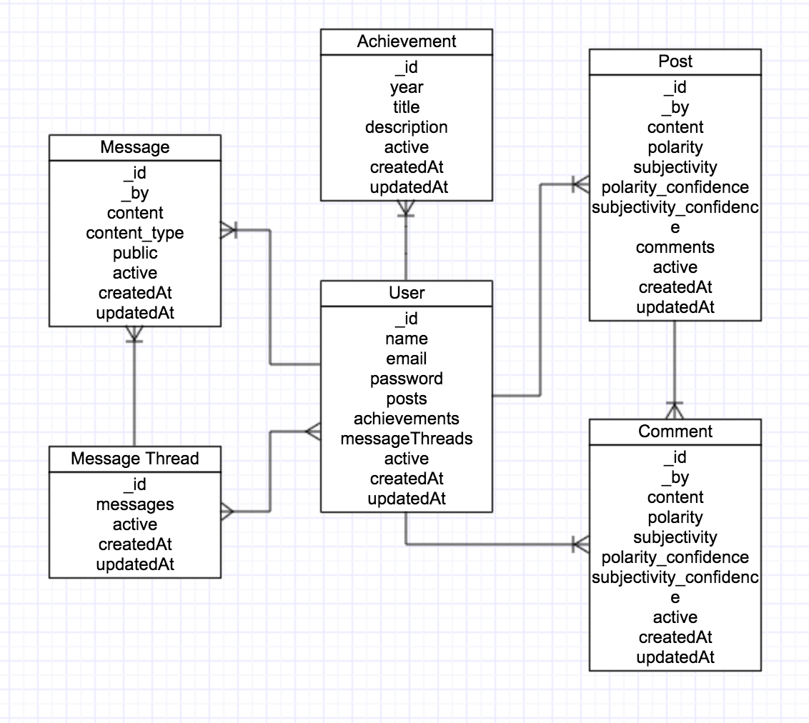

#nUPath

###About:

In the modern age of social media, students have various platforms for communicating with friends and family alike. What’s missing is a place for students to connect to other students without the noise of status updates and tweets. **nUPath** provides a noise free, safe zone for students to discuss academia and their achievements.   

**nUPath** is designed with the purpose of helping students get a jumpstart on their career path after graduation. High school juniors and seniors can use nUPath as their first online resume/portfolio. College students can use nUPath to enhance their resume building skills and gain access to other universities and employers. Through nUPath, students can connect worldwide to teachers, professors, faculty members, and fellow students.  

### Authors
1. Glover, Tiffany - [@tifsheline](https://github.com/tifsheline)
2. Pagtakhan, Kevin - [@kevinpagtakhan](https://github.com/kevinpagtakhan)
2. Rayamajhi, Anil - [@anilrayamajhi](https://github.com/anilrayamajhi)

## Development

### Wireframe

### Entity Relationship Diagram

###Technologies Used
* Language: Javascript
* Web-Application Frameworks: Node.js and Express
* Front-end technologies: Angular.js, Bootstrap
* Database: MongoDB
* Deployment: Heroku
* Third-party APIs: Giphy, AYLIEN Text Analysis

###User Stories
1. I can login/logout into/from the system.
2. As a user, I can register and create a profile by providing my name, email address and school affiliation.
3. As a user, I can build my online portfolio by submitting to the achievements form.
4. As a user, I have access to a news feed where I can create my posts and read other users' posts.
5. As a user, I can create and read comments on other users' post.
6. As a user, I can send messages to other users through the direct messaging.
7. As a user, I can join the community chat room and interact real-time with other users by sending and receiving messages and gif images.
8. As a user, I won't be able to create and view negative posts to keep the online community safe as it is meant to be.

## Future Work

1. As a user, I can to follow other users.
2. As a user, I can interact real-time using the direct massaging feature.
3. As a user, I can to have a link to my profile which I can send to schools, universities, and employers so they can view my profile.

### How to run locally
1. Install Node.js.
2. Clone the repo.

        $ git clone https://github.com/kevinpagtakhan/nupath.git

3. Change your directory to nupath.

        $ cd nupath
        
4. Install dependencies.

		  $ npm install

5. Spin up the node server

		  $ node server.js

6. Open your Google Chrome and go to `http://localhost:3000`. Change the port if needed.

### How to contribute
1. Fork it
2. Create your feature branch: git checkout -b new-feature
3. Commit your changes: git commit -m 'Some feature'
4. Push to your feature branch: git push origin new-feature
5. Submit a pull request

## Acknowledgements:
Credits:

* npm packages:

npm Packages| Author/Authors
--------------|------
express | ganey
